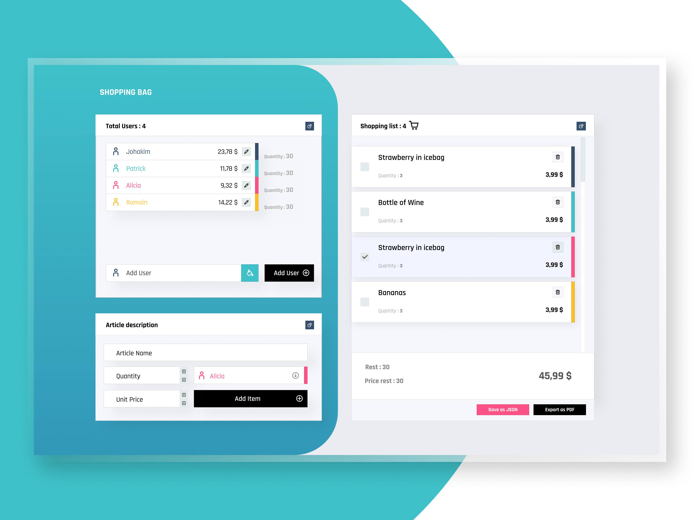

# Shooper

Create your shopping list for yourself or for your group of friends and estimate the price in advance of your total purchases.

Each user can have his own shopping list. Estimate the amount that everyone has to pay.



## Setup

1. clone the respositoty

```bash
git clone https://github.com/OliveCh12/shooper.git
```

2. Install dependencies

```bash
npm install
```

## How to use

First, add one or multiple users in the first panel. You can also specify a color per user otherwise shopper automatically creates a color for each user created.

Then you can add as many items as you want in the panel `Add Item` by specifying the user for each added item.

## License

Distributed under the MIT License. See LICENSE for more information.
